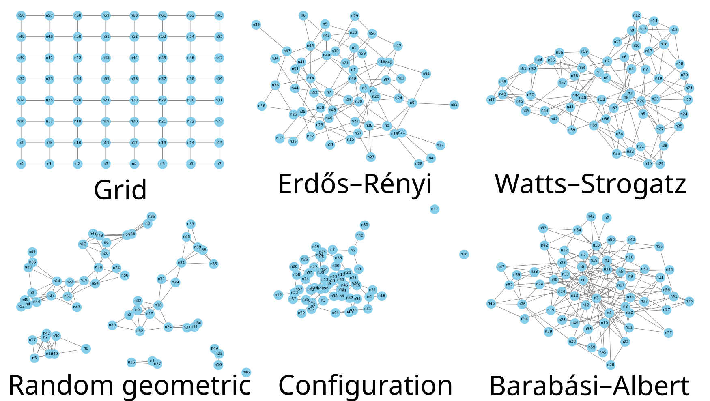

==========================
Network Generator
==========================

``ndtools.network_generator`` creates synthetic network datasets (nodes, edges, probabilities)
that conform to this repo’s schemas.

Quick Start (Windows cmd)
=========================

You can call the generator from ndtools:

.. code-block:: python

   from pathlib import Path
   from ndtools.network_generator import GenConfig, generate_and_save

   cfg = GenConfig(
       name="ws_n60_k6_b015",
       generator="ws",
       description="WS n=60 k=6 beta=0.15",
       generator_params={"n_nodes": 60, "k": 6, "p_ws": 0.15, "p_fail": 0.1},
       seed=7,
   )
   repo_root = Path(__file__).resolve().parents[1]
   out_base = repo_root / "generated"

   ds_root = generate_and_save(out_base, cfg, draw_graph=True)
   print("Wrote:", ds_root)

Available Network Types
=========================

Overview
---------

.. list-table:: Comparison of supported network models
   :header-rows: 1
   :widths: 20 20 20 40

   * - Network type
     - Generative principle
     - Key structural feature
     - Typical real-world interpretation
   * - Grid
     - Regular lattice
     - Uniform degree
     - Planned grid-layout road networks
   * - Erdős–Rényi (ER)
     - Random edge formation
     - Homogeneous degree distribution
     - Purely random connectivity
   * - Watts–Strogatz (WS)
     - Local lattice with random rewiring
     - High clustering, short paths
     - Small-world networks (e.g. social or collaboration networks)
   * - Random geometric
     - Spatial proximity
     - Spatial clustering
     - Physical infrastructure networks constrained by distance (e.g. roads, pipelines, power distribution)
   * - Configuration graph
     - Fixed number of connections per node
     - Non-uniform number of connections across nodes
     - Networks preserving observed node connectivities while randomising links
   * - Barabási–Albert (BA)
     - Growth with preferential attachment
     - Scale-free degree distribution with hubs
     - Hub-based networks formed by growth (e.g. airline, internet, service networks)

Example networks are illustrated below:

   *Figure 2.* Example networks generated by the random network generator.

where the models are generated with parameters:
   - Grid (8×8), 
   - Erdős–Rényi (n=60, p=0.05), 
   - Watts–Strogatz (n=60, k=6, β=0.15),
   - Random Geometric (n=60, r=0.17), 
   - Configuration model (n=60, avg_deg=3),
   - Barabási–Albert (n=60, m=3).

Notes on Edge Counts
---------------------

- **ER**: expected edges :math:`E \approx p \cdot \frac{n(n-1)}{2}`.
- **WS**: edges fixed by ``k``: :math:`E = \frac{n k}{2}` (β changes structure, not count).
- **BA**: edges fixed by ``m``: :math:`E = m n - \frac{m(m+1)}{2}`.
- **RG**: edges grow roughly with :math:`r^2`; tune ``--radius`` (e.g., ``0.17`` for ~150 edges at ``n=60``).
- **Config**: edges follow the synthesized degree sequence; ``avg_deg`` ≈ ``2E/n``.

Network generator parameters
============================

The high-level entry point is ``generate_and_save(out_base, config, ...)``,
which (i) generates a network, (ii) assigns edge failure probabilities,
(iii) saves the dataset, (iv) optionally validates schema, visualises the graph,
and updates the registry.

Common (applies to all generators)
----------------------------------

These parameters are read from ``config`` and affect all network types.

``out_base`` (Path)
  Output base directory. The dataset is saved under this path.

``config.generator`` (str)
  Generator type. Supported values:
  ``grid|lattice|erdos_renyi|er|watts_strogatz|ws|barabasi_albert|ba|configuration|config|random_geometric|rg``.

``config.name`` (str)
  Dataset name (used for the dataset folder).

``config.version`` (str)
  Dataset version label used in the output path.

``config.description`` (str)
  Human-readable description written to metadata/README.

``config.seed`` (int)
  Random seed for reproducibility (used by all generators except ``grid`` / ``lattice``).

``config.generator_params`` (dict)
  Dictionary of generator parameters (see "Generator-specific parameters" below).

``p_fail`` (float; inside ``config.generator_params``)
  Edge failure probability used by ``assign_edge_probs``.
  Survival probability is ``1 - p_fail``.
  If omitted, defaults to ``0.1``.

Generator-specific parameters
-----------------------------

These live inside ``config.generator_params`` and depend on ``config.generator``.

Grid / Lattice (``grid`` or ``lattice``)
^^^^^^^^^^^^^^^^^^^^^^^^^^^^^^^^^^^^^^^^

``rows`` (int)
  Number of grid rows.

``cols`` (int)
  Number of grid columns.

Erdős–Rényi (``erdos_renyi`` or ``er``)
^^^^^^^^^^^^^^^^^^^^^^^^^^^^^^^^^^^^^^^

``n_nodes`` (int)
  Number of nodes.

``p`` (float)
  Edge probability.

Watts–Strogatz (``watts_strogatz`` or ``ws``)
^^^^^^^^^^^^^^^^^^^^^^^^^^^^^^^^^^^^^^^^^^^^^

``n_nodes`` (int)
  Number of nodes.

``k`` (int)
  Each node is connected to ``k`` nearest neighbours in ring topology (typically even).

``p_ws`` (float)
  Rewiring probability (β).
  Internally mapped to ``p_rewire`` for the underlying generator function.

Barabási–Albert (``barabasi_albert`` or ``ba``)
^^^^^^^^^^^^^^^^^^^^^^^^^^^^^^^^^^^^^^^^^^^^^^^^

``n_nodes`` (int)
  Number of nodes.

``m`` (int)
  Number of edges to attach from each new node to existing nodes.

Configuration model (``configuration`` or ``config``)
^^^^^^^^^^^^^^^^^^^^^^^^^^^^^^^^^^^^^^^^^^^^^^^^^^^^^

``n_nodes`` (int)
  Number of nodes.

``avg_deg`` (float)
  Target average degree.

Random Geometric (``random_geometric`` or ``rg``)
^^^^^^^^^^^^^^^^^^^^^^^^^^^^^^^^^^^^^^^^^^^^^^^^^

``n_nodes`` (int)
  Number of nodes.

``radius`` (float)
  Connection radius (typically in ``[0, 1]`` depending on your implementation).

Pipeline options (not network-specific)
---------------------------------------

These are keyword arguments to ``generate_and_save`` that affect saving/validation/visualisation,
not the graph topology itself.

``update_registry_flag`` (bool, default ``False``)
  If ``True``, update ``registry.json`` at the repository root with the new dataset entry.

Visualisation options
^^^^^^^^^^^^^^^^^^^^^

``draw_graph`` (bool, default ``True``)
  If ``True``, attempt to render a graph image from saved data.

``graph_layout`` (str, default ``"spring"``)
  Layout name passed to the drawing function.

``graph_name`` (str, default ``"graph.png"``)
  Output image filename.

``graph_kwargs`` (dict or None)
  Extra keyword arguments forwarded to the drawing function.

Schema validation
^^^^^^^^^^^^^^^^^

``schema_dir`` (Path or None)
  If provided, validate the generated dataset against the schema in this directory.

Generated Datasets
===================

Data Structure
------------------

Example generated datasets are available under::

  generated/<name>/v1/
    data/
      nodes.json
      edges.json
      probs.json
      graph.png         (if plotting enabled)
    README.md
    metadata.json

File Details
-------------

``nodes.json`` (dict)
   ``{"n0": {"x": <float|null>, "y": <float|null>}, ...}``

   * Grid assigns integer lattice coordinates (``x = i % cols``, ``y = i // cols``).
   * ER / WS / BA / Config set ``x,y`` to ``null`` (no embedded coordinates).
   * RG sets positions from the unit-square coordinates used to build the graph.

``edges.json`` (dict)
   ``{"e0": {"from": "n0", "to": "n1", "directed": false}, ...}``

``probs.json`` (dict)
   Binary edge state probabilities (failure/survival) per edge id::

     {
       "e0": {"0": {"p": 0.1}, "1": {"p": 0.9}},
       ...
     }

``graph.png`` (optional)
   A preview figure rendered by :func:`ndtools.graphs.draw_graph_from_data`.
   If nodes have numeric ``x,y`` (e.g., RG, Grid), those are used; otherwise a layout is computed.

Acknowledgments
===============

The network generator extensions were drafted by `Alex Sixie Cao <https://scholar.google.com/citations?user=QUu8BdEAAAAJ&hl=en>`__.
